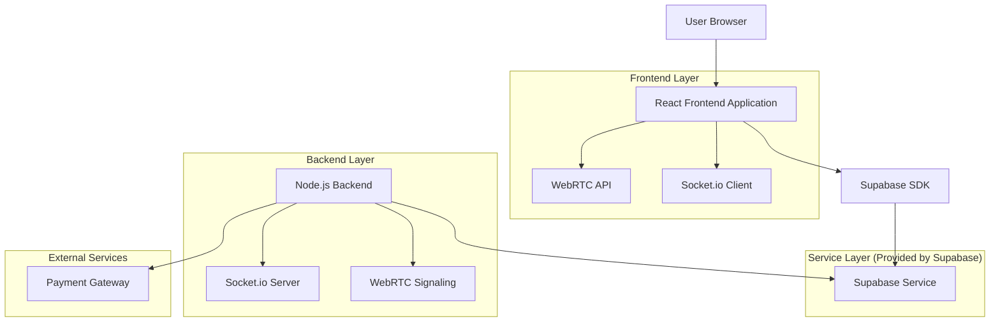
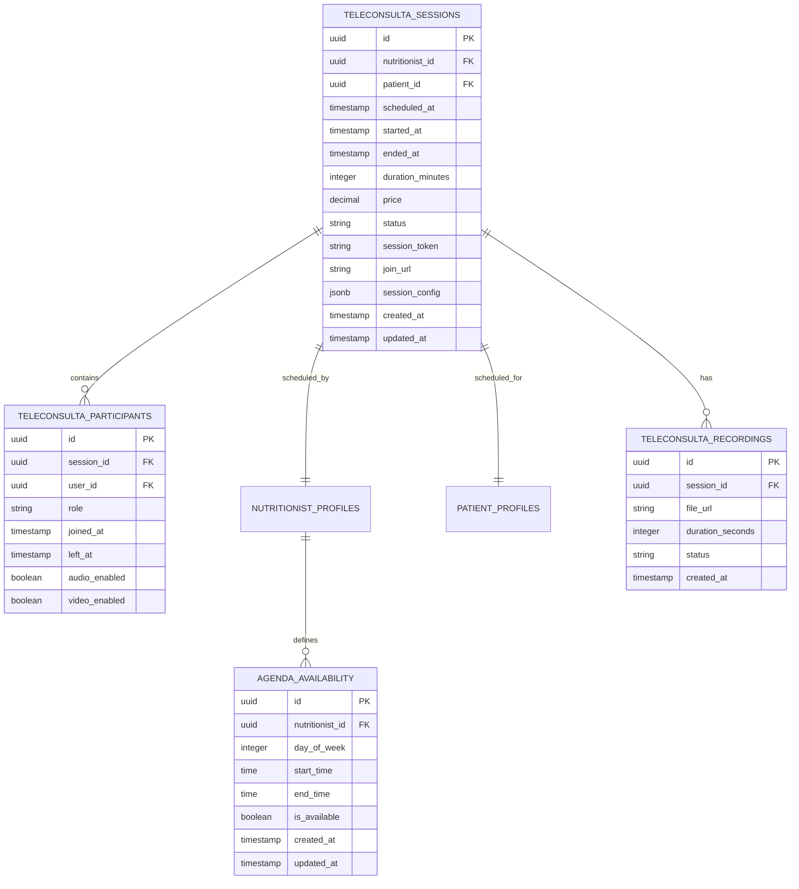

# Arquitetura Técnica - Sistema de Telemedicina

## 1. Architecture design



## 2. Technology Description

* Frontend: React\@18 + Next.js\@14 + tailwindcss\@3 + TypeScript

* Backend: Node.js + Express\@4 + Socket.io\@4

* Database: Supabase (PostgreSQL)

* WebRTC: Simple-peer + Socket.io para sinalização

* Real-time: Supabase Realtime + Socket.io

* Payment: Stripe ou PagSeguro

* Storage: Supabase Storage para gravações

## 3. Route definitions

| Route                                   | Purpose                                         |
| --------------------------------------- | ----------------------------------------------- |
| /dashboard/paciente/teleconsultas       | Lista de teleconsultas do paciente, agendamento |
| /dashboard/nutricionistas/agenda        | Agenda e gerenciamento de teleconsultas         |
| /teleconsulta/\[sessionId]              | Sala de videoconferência                        |
| /teleconsulta/agendar/\[nutritionistId] | Agendamento de teleconsulta                     |
| /api/teleconsulta/create                | Criar nova sessão de teleconsulta               |
| /api/teleconsulta/join/\[sessionId]     | Entrar em sessão existente                      |

## 4. API definitions

### 4.1 Core API

**Criar Teleconsulta**

```
POST /api/teleconsulta/create
```

Request:

| Param Name       | Param Type | isRequired | Description                   |
| ---------------- | ---------- | ---------- | ----------------------------- |
| nutritionist\_id | string     | true       | ID do nutricionista           |
| patient\_id      | string     | true       | ID do paciente                |
| scheduled\_at    | string     | true       | Data/hora agendada (ISO 8601) |
| duration         | number     | true       | Duração em minutos            |
| price            | number     | true       | Valor da consulta             |

Response:

| Param Name  | Param Type | Description                 |
| ----------- | ---------- | --------------------------- |
| session\_id | string     | ID único da sessão          |
| join\_url   | string     | URL para entrar na consulta |
| status      | string     | Status da criação           |

Example:

```json
{
  "nutritionist_id": "uuid-123",
  "patient_id": "uuid-456",
  "scheduled_at": "2024-01-15T14:00:00Z",
  "duration": 60,
  "price": 150.00
}
```

**Entrar na Teleconsulta**

```
GET /api/teleconsulta/join/[sessionId]
```

Request:

| Param Name | Param Type | isRequired | Description   |
| ---------- | ---------- | ---------- | ------------- |
| sessionId  | string     | true       | ID da sessão  |
| user\_id   | string     | true       | ID do usuário |

Response:

| Param Name    | Param Type | Description              |
| ------------- | ---------- | ------------------------ |
| access\_token | string     | Token de acesso à sessão |
| ice\_servers  | array      | Servidores STUN/TURN     |
| session\_data | object     | Dados da sessão          |

**Gerenciar Agenda**

```
GET /api/agenda/[nutritionistId]
POST /api/agenda/availability
```

## 5. Server architecture diagram

```mermaid
graph TD
    A[Client / Frontend] --> B[Controller Layer]
    B --> C[Service Layer]
    C --> D[Repository Layer]
    D --> E[(Supabase Database)]
    
    B --> F[WebRTC Signaling Service]
    B --> G[Socket.io Handler]
    C --> H[Payment Service]
    C --> I[Notification Service]
    
    subgraph Server
        B
        C
        D
        F
        G
    end
    
    subgraph External
        H
        I
    end
end
```

## 6. Data model

### 6.1 Data model definition



### 6.2 Data Definition Language

**Teleconsulta Sessions Table**

```sql
-- create table
CREATE TABLE teleconsulta_sessions (
    id UUID PRIMARY KEY DEFAULT gen_random_uuid(),
    nutritionist_id UUID NOT NULL REFERENCES nutritionist_profiles(id),
    patient_id UUID NOT NULL REFERENCES patient_profiles(id),
    scheduled_at TIMESTAMP WITH TIME ZONE NOT NULL,
    started_at TIMESTAMP WITH TIME ZONE,
    ended_at TIMESTAMP WITH TIME ZONE,
    duration_minutes INTEGER NOT NULL DEFAULT 60,
    price DECIMAL(10,2) NOT NULL,
    status VARCHAR(20) DEFAULT 'scheduled' CHECK (status IN ('scheduled', 'in_progress', 'completed', 'cancelled')),
    session_token VARCHAR(255) UNIQUE NOT NULL,
    join_url TEXT NOT NULL,
    session_config JSONB DEFAULT '{}',
    created_at TIMESTAMP WITH TIME ZONE DEFAULT NOW(),
    updated_at TIMESTAMP WITH TIME ZONE DEFAULT NOW()
);

-- create indexes
CREATE INDEX idx_teleconsulta_sessions_nutritionist_id ON teleconsulta_sessions(nutritionist_id);
CREATE INDEX idx_teleconsulta_sessions_patient_id ON teleconsulta_sessions(patient_id);
CREATE INDEX idx_teleconsulta_sessions_scheduled_at ON teleconsulta_sessions(scheduled_at);
CREATE INDEX idx_teleconsulta_sessions_status ON teleconsulta_sessions(status);

-- permissions
GRANT SELECT ON teleconsulta_sessions TO anon;
GRANT ALL PRIVILEGES ON teleconsulta_sessions TO authenticated;
```

**Teleconsulta Participants Table**

```sql
-- create table
CREATE TABLE teleconsulta_participants (
    id UUID PRIMARY KEY DEFAULT gen_random_uuid(),
    session_id UUID NOT NULL REFERENCES teleconsulta_sessions(id) ON DELETE CASCADE,
    user_id UUID NOT NULL,
    role VARCHAR(20) NOT NULL CHECK (role IN ('nutritionist', 'patient')),
    joined_at TIMESTAMP WITH TIME ZONE DEFAULT NOW(),
    left_at TIMESTAMP WITH TIME ZONE,
    audio_enabled BOOLEAN DEFAULT true,
    video_enabled BOOLEAN DEFAULT true
);

-- create indexes
CREATE INDEX idx_teleconsulta_participants_session_id ON teleconsulta_participants(session_id);
CREATE INDEX idx_teleconsulta_participants_user_id ON teleconsulta_participants(user_id);

-- permissions
GRANT SELECT ON teleconsulta_participants TO anon;
GRANT ALL PRIVILEGES ON teleconsulta_participants TO authenticated;
```

**Agenda Availability Table**

```sql
-- create table
CREATE TABLE agenda_availability (
    id UUID PRIMARY KEY DEFAULT gen_random_uuid(),
    nutritionist_id UUID NOT NULL REFERENCES nutritionist_profiles(id),
    day_of_week INTEGER NOT NULL CHECK (day_of_week >= 0 AND day_of_week <= 6),
    start_time TIME NOT NULL,
    end_time TIME NOT NULL,
    is_available BOOLEAN DEFAULT true,
    created_at TIMESTAMP WITH TIME ZONE DEFAULT NOW(),
    updated_at TIMESTAMP WITH TIME ZONE DEFAULT NOW()
);

-- create indexes
CREATE INDEX idx_agenda_availability_nutritionist_id ON agenda_availability(nutritionist_id);
CREATE INDEX idx_agenda_availability_day_of_week ON agenda_availability(day_of_week);

-- permissions
GRANT SELECT ON agenda_availability TO anon;
GRANT ALL PRIVILEGES ON agenda_availability TO authenticated;

-- init data
INSERT INTO agenda_availability (nutritionist_id, day_of_week, start_time, end_time, is_available)
SELECT 
    id,
    generate_series(1, 5) as day_of_week,
    '09:00:00'::time as start_time,
    '17:00:00'::time as end_time,
    true as is_available
FROM nutritionist_profiles
LIMIT 5;
```

**Teleconsulta Recordings Table**

```sql
-- create table
CREATE TABLE teleconsulta_recordings (
    id UUID PRIMARY KEY DEFAULT gen_random_uuid(),
    session_id UUID NOT NULL REFERENCES teleconsulta_sessions(id),
    file_url TEXT NOT NULL,
    duration_seconds INTEGER,
    status VARCHAR(20) DEFAULT 'processing' CHECK (status IN ('processing', 'ready', 'failed')),
    created_at TIMESTAMP WITH TIME ZONE DEFAULT NOW()
);

-- create indexes
CREATE INDEX idx_teleconsulta_recordings_session_id ON teleconsulta_recordings(session_id);

-- permissions
GRANT SELECT ON teleconsulta_recordings TO anon;
GRANT ALL PRIVILEGES ON teleconsulta_recordings TO authenticated;
```

