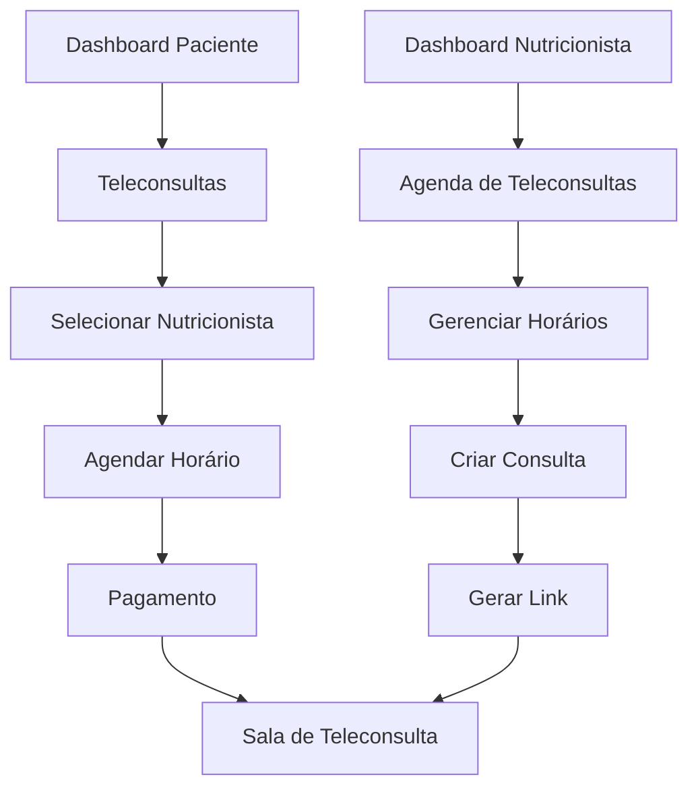

# Sistema de Telemedicina - BuscaNutri

## 1. Product Overview

Sistema de telemedicina integrado ao BuscaNutri que permite consultas online entre nutricionistas e pacientes através de videoconferência.

O sistema resolve a necessidade de atendimento remoto, permitindo que pacientes tenham acesso a consultas nutricionais de qualquer lugar, enquanto nutricionistas podem expandir seu alcance e otimizar sua agenda. Integra-se perfeitamente à plataforma existente, mantendo a experiência unificada do usuário.

O objetivo é aumentar a acessibilidade aos serviços de nutrição e gerar novas oportunidades de receita para nutricionistas através de consultas online.

## 2. Core Features

### 2.1 User Roles

| Role | Registration Method | Core Permissions |
|------|---------------------|------------------|
| Paciente | Cadastro existente no BuscaNutri | Agendar teleconsultas, participar de sessões de vídeo, visualizar histórico |
| Nutricionista | Perfil profissional verificado | Gerenciar agenda, criar sessões, gerar links únicos, controlar disponibilidade |

### 2.2 Feature Module

Nosso sistema de telemedicina consiste nas seguintes páginas principais:

1. **Dashboard do Paciente**: menu atualizado com link para teleconsultas, visualização de consultas agendadas.
2. **Dashboard do Nutricionista**: menu com acesso à área de controle de agenda e teleconsultas.
3. **Agenda do Nutricionista**: calendário interativo, gerenciamento de horários disponíveis/ocupados.
4. **Sala de Teleconsulta**: interface de videoconferência, chat em tempo real, compartilhamento de tela.
5. **Agendamento de Teleconsulta**: seleção de horários, confirmação de pagamento, geração de links.

### 2.3 Page Details

| Page Name | Module Name | Feature description |
|-----------|-------------|---------------------|
| Dashboard do Paciente | Menu de Teleconsultas | Adicionar link "Teleconsultas" no menu lateral, exibir próximas consultas online agendadas |
| Dashboard do Nutricionista | Menu de Agenda | Adicionar link "Agenda de Teleconsultas" no menu, mostrar estatísticas de consultas online |
| Agenda do Nutricionista | Calendário Interativo | Visualizar agenda mensal/semanal, definir horários disponíveis, bloquear períodos indisponíveis |
| Agenda do Nutricionista | Gerenciamento de Consultas | Criar nova teleconsulta, gerar link único, copiar/compartilhar link, editar detalhes da sessão |
| Sala de Teleconsulta | Interface de Vídeo | Videoconferência WebRTC, controles de áudio/vídeo, chat lateral, gravação opcional |
| Sala de Teleconsulta | Ferramentas Clínicas | Compartilhamento de tela, anotações em tempo real, upload de documentos |
| Agendamento de Teleconsulta | Seleção de Horários | Mostrar disponibilidade do nutricionista, selecionar data/hora, confirmar agendamento |
| Agendamento de Teleconsulta | Processamento de Pagamento | Integração com gateway de pagamento, confirmação automática, envio de links por email |

## 3. Core Process

### Fluxo do Paciente
1. Paciente acessa dashboard e clica em "Teleconsultas"
2. Visualiza nutricionistas disponíveis para consulta online
3. Seleciona nutricionista e horário disponível
4. Realiza pagamento da consulta
5. Recebe link da sala de teleconsulta por email
6. No horário agendado, acessa a sala através do link
7. Participa da consulta com vídeo, áudio e chat

### Fluxo do Nutricionista
1. Nutricionista acessa dashboard e clica em "Agenda de Teleconsultas"
2. Define horários disponíveis no calendário
3. Cria nova teleconsulta ou aceita agendamento de paciente
4. Sistema gera link único para a sessão
5. Nutricionista copia/compartilha link com paciente
6. No horário agendado, inicia a consulta na sala virtual
7. Conduz atendimento com ferramentas clínicas disponíveis

## 4. User Interface Design

### 4.1 Design Style

- **Cores primárias**: Azul #3B82F6 (confiança médica), Verde #10B981 (saúde)
- **Cores secundárias**: Cinza #6B7280 (neutro), Branco #FFFFFF (limpeza)
- **Estilo de botões**: Arredondados com sombra sutil, efeito hover suave
- **Fontes**: Inter para interface (14px-16px), títulos em 18px-24px
- **Layout**: Design limpo e minimalista, cards com bordas arredondadas, navegação lateral
- **Ícones**: Lucide React com estilo outline, ícones médicos específicos para teleconsulta

### 4.2 Page Design Overview

| Page Name | Module Name | UI Elements |
|-----------|-------------|-------------|
| Dashboard do Paciente | Menu de Teleconsultas | Ícone de vídeo, badge com número de consultas agendadas, cor azul para destaque |
| Dashboard do Nutricionista | Menu de Agenda | Ícone de calendário, indicador de consultas do dia, notificações em tempo real |
| Agenda do Nutricionista | Calendário | Grid responsivo, cores diferenciadas para disponível/ocupado, modal para criar consulta |
| Sala de Teleconsulta | Interface de Vídeo | Layout split-screen, controles flutuantes, chat lateral retrátil, fundo neutro |
| Agendamento | Seleção de Horários | Calendário interativo, slots de tempo clicáveis, resumo da consulta, botão CTA verde |

### 4.3 Responsiveness

O sistema é mobile-first com adaptação completa para desktop. Interface otimizada para touch em tablets e smartphones, com controles de vídeo adaptados para diferentes tamanhos de tela. Prioriza usabilidade em dispositivos móveis para consultas em movimento.